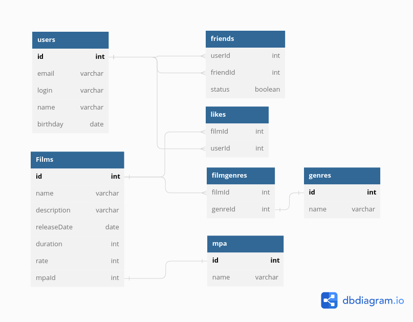

# java-filmorate

### База Данных

#### Таблицы
- **USERS** список пользователей
- **FILMS** список фильмов
- **FRIENDS** связи дружбы между пользователями: *userId* - id пользователя, *fritndId* - id друга, *status* - статус подтверждения дружбы
- **LIKES** лайки пользователей: *filmId* - id фильма, *userId* - id пользователя поставившего лайк
- **MPA** рейтинг Ассоциации кинокомпаний
- **GENRES** список жанров
- **FILMGENRES** список жанров фильмов: *filmId* - id фильма, *genreId* - id жанра

#### Примеры запросов
Запрос списка фильмов в жанре комедии

*SELECT * FROM FILMS, FILMGENRES, GENRES
WHERE FILMS.id=FILMGENRES.filmId AND FILMGENRES.genreId=GENRES.id AND GENRES.name='комедия'*

Запрос списка фильмов котрые понравились пользователю с логином IvanPetrov

*SELECT * FROM FILMS,LIKES,USERS
WHERE FILMS.id=LIKES.filmId AND USER.id=LIKES.userId AND USER.login='IvanPetrov'*

